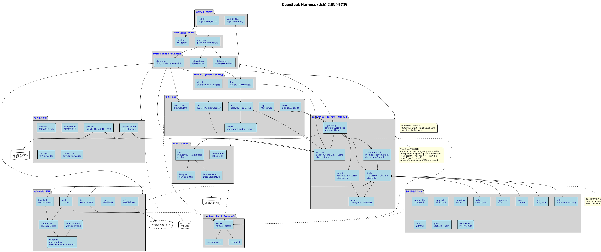

# 系统架构说明

> 本文档基于 AST 符号工具对源码符号验证生成。架构图见 [system-component-architecture.puml](./system-component-architecture.puml)。

## 1. 架构概述

### 1.1 架构模式

DeepSeek Harness（`dsh`）采用**插件式 Agent Harness 架构**，核心设计原则源自 [Cordis](https://github.com/cordiverse/cordis) 框架。整体融合了以下架构模式：

| 模式 | 体现 |
|---|---|
| **插件架构（一切皆插件）** | 没有特权核心。模型适配器、工具注册表、会话日志、agent loop 本身都是插件，均可从配置替换。 |
| **能力接缝（Capability Seams）** | 每个可替换能力由三角色构成：Service Definition（接口）、Service Provider（实现）、Consumer（消费，常为面向模型的工具）。 |
| **事件驱动 / 事件溯源** | 会话是追加只写的事件日志（`SessionEvent`）；派生、分叉、恢复、遥测均从事件流推导。 |
| **Monorepo（pnpm workspace）** | 49 个 package group，按职责分组，统一 scope `@deepseek-ai/dsh-*`。 |
| **分层组合（Profile / Bundle）** | 运行中的 dsh 是启动时按有序层组合的插件树，支持 patch 覆盖。 |
| **Host / Client 双半** | Web-GUI 拆为 host（API 网关）与 client（浏览器侧）两半，各自独立打包。 |

### 1.2 设计原则

1. **一切皆插件，注册是可逆 effect**：每个贡献通过 `ctx.effect()` / `ctx.on()` / `ctx.waterfall()` 进入共享上下文；`register()` 返回 disposer，插件卸载时自动回滚。
2. **模型可见即已记录**：任何到达模型请求的内容必须能从会话日志重建。运行时不变式断言此约束。新增模型可见输入需扩展 `SessionEventMap` 并从日志渲染。
3. **扩展插件依赖 Service Definition，而非具体 Provider**：`dsh-agent-loop` 可替换；UI、hook、工具插件使用 `dsh-agent`。换一个 provider 即迁移整个执行世界（如本地→远程沙箱）。
4. **运行时不变式断言所有权关系**：检查权威事件流或可变数据，而非服务/方法存在性、插件元数据或固定示例。
5. **Pre-release 优先正确基础**：无外部消费者时，优先正确基础而非兼容垫片——可自由重命名/重打包并同步更新所有引用。

## 2. 系统分层

### 2.1 层级说明

系统自顶向下分为 7 层（详见 [分层架构文档](../03-layers/)）：

| 层 | 职责 | 代表包 |
|---|---|---|
| **L1 应用入口** | CLI/Web 启动入口 | `apps/cli`、`apps/web` |
| **L2 Boot 组合** | Profile/Bundle 层组合、命令行解析 | `boot/app-boot`、`boot/cmdline`、`bundle/*` |
| **L3 Host/Client 双半** | API 网关、HTTP 路由、浏览器 shell | `host`、`client` |
| **L4 Core API 主干** | 会话、agent、工具、prompt、loop | `core/*` |
| **L5 能力接缝** | 执行环境 + 模型协作能力 | `shell`、`fs`、`llm`、`skill`、`web` 等 |
| **L6 持久化与检索** | 会话持久化、存储、设置、凭据 | `session`、`storage`、`settings` |
| **L7 协议与集成** | RPC、ACP、hooks、交互 | `api`、`typert`、`sdk`、`acp`、`hooks`、`interaction` |

所有层均构建于 vendored Cordis 框架之上。

### 2.2 层间依赖关系

- **向下依赖**：上层依赖下层 Service Definition，不依赖具体 Provider。
- **无循环依赖**：`dsh-agent-loop` 可被替换；能力 Consumer 通过 `ctx.tools` 注册，不直接依赖 loop。
- **Cordis 是 peerDependency**：每个 harness 包都将 `@deepseek-ai/cordis` 声明为 peerDependency（+ dev），确保单一上下文实例。
- **依赖图由生成器维护**：`pnpm run gen-module-graph` 生成 `docs/module-graph.md`，CI 新鲜度门禁校验。

## 3. 核心组件

### 组件 1：AgentLoop（默认驱动）

- **职责**：实现 `Agent` 接口的默认驱动，编排 Turn/Step 生命周期。
- **主要功能**：claim 输入 → 装配 prompt+tools → 模型请求 → 工具执行 → 步结束 → 回合结束。
- **技术实现**：基于 Cordis waterfall 事件（`agent/pre-step`、`agent/request`、`llm/stream`、`tools/*`）；`agent/turn-stopping` 是串行终端检查点（无 `next()`）。
- **代码路径**：`packages/core/agent-loop/src/index.ts`
- **符号验证**：`AgentLoop` 类（L295-710）、`createAgent` 方法（L605-621）、`ReactLoopAgent` 类（`agent.ts` L63-495）、`AgentLoopSettings` 接口（L243-246）。

### 组件 2：ToolRuntime（工具注册表与执行管线）

- **职责**：作用域工具注册表 + 受保护的执行管线。
- **主要功能**：工具定义注册、pre/concurrent execute/post 三阶段调度、barrier 与有界滚动池、工具结果融合。
- **技术实现**：`ToolDefinition` 接口描述工具 schema；`ToolLayer` 管理分层；`defineTool()` 工厂（`schema.ts` L544-616）。
- **代码路径**：`packages/core/tools/src/index.ts`
- **符号验证**：`ToolRuntime` 类（L786-1862）、`ToolDefinition` 接口（L221-287）、`ToolLayer` 类（L713-753）、`dispatchToolBody` 方法（L1531-1559）、`fuseToolSignals` 函数（L1888-1915）。

### 组件 3：SessionStore（会话事件日志）

- **职责**：追加只写的 `SessionEvent` 日志 + 内存存储；派生模型历史。
- **主要功能**：事件追加、模型历史派生（`deriveMessages()`）、会话分叉（`fork`）、标题生成、遥测。
- **技术实现**：事件溯源；`SessionEventMap` 声明合并扩展；raw `assistant/chunk` 保留回放与 UI 保真。
- **代码路径**：`packages/core/session/src/index.ts`
- **符号验证**：`Session` 类（L424-757）、`SessionStore` 类（L791-1154）、`SessionEventMap` 接口（`types.ts` L235-332）、`SessionHeader` 接口（L60-98）。

### 组件 4：LLM 适配器接缝

- **职责**：消息与流词汇表 + 适配器接缝。
- **主要功能**：流式 chunk、消息类型、provider 注册。
- **技术实现**：`ctx.llm` waterfall；DeepSeek 官方适配器 + 可选 pi-ai 后端。
- **代码路径**：`packages/llm/llm/src`、`packages/llm/llm-deepseek/src`

### 组件 5：执行世界（fs + subprocess + sandbox + shell）

- **职责**：文件系统访问、子进程生成、进程限制、Bash 执行。
- **主要功能**：共享一个执行世界——指向远程沙箱即可迁移 Bash、PTY、LSP。
- **技术实现**：`ctx.fs` + `ctx.subprocess` + `ctx.sandbox` + `ctx.shell`；沙箱后端 bwrap（Linux）/ Landlock（Linux，原生 addon）/ Seatbelt（macOS）。
- **代码路径**：`packages/fs/`、`packages/subprocess/`、`packages/sandbox/`、`packages/shell/`

### 组件 6：Boot 组合器

- **职责**：启动时按有序层组合插件树。
- **主要功能**：读取 profile → 加载 bundle 列表 → 应用 patch overlay → 构建插件树。
- **技术实现**：层应用顺序：每个 bundle（profile 列出顺序）→ profile `cordis.patch.yml` → home 级 → `--patch` overlay。
- **代码路径**：`packages/boot/app-boot/src`

### 组件 7：Typert 类型图

- **职责**：类型图生成、加载、运行时注册。
- **主要功能**：跨语言（TS/Python）类型契约；RPC 网关的类型基础。
- **代码路径**：`packages/typert/generator`、`packages/typert/loader`、`packages/typert/protocol`、`packages/typert/registry`

## 4. 数据流

### 4.1 Turn/Step 请求处理流程

一个 **step** = 一次模型请求 + 其调用的工具。一个 **turn** = 零或多个 step：在第一个输入被 claim 前打开，在无待办时关闭。

```
turn/start
  claim 下一 step 输入 + 一条排队消息
  装配 prompt sections + tool schemas
  -> agent/pre-step (waterfall)        拒绝 | enter(messages)
     拒绝 / 首次 enter 重写为空 -> 无 step 关闭 turn
     step/start
     追加 entered messages 为 user/message
     从日志派生模型历史
     agent/request -> llm/stream -> assistant/chunk* -> assistant/message
     tool/call* -> tools/pre-execute -> tools/execute -> tools/post-execute -> tool/result*
     step/end
     工具欠另一次请求 / 下一 step 输入到达 -> claim -> 下一 step
  -> agent/turn-stopping (serial, 无 next)
turn/end
```

**事件域划分**：
- **持久会话事件**：`turn/*`、`step/*`、`user/message`、`assistant/*`、`tool/*`（写入日志，可重放）。
- **实时扩展点**：`agent/pre-step`、`agent/request`、`llm/stream`、`tools/*`（waterfall，监听者须调 `next()` 委托）。
- **串行终端**：`agent/turn-stopping`（无 `next()`）。

输入通过单一 inbox 到达驱动。部分消息立即唤醒；注入的上下文在 inbox 中等待直至另一消息到达。`agent/pre-step` 决定模型所见——监听者可重写 claimed 消息或直接拒绝。

### 4.2 数据持久化流程

- **会话事件**追加到 `SessionEvent` 日志（内存）→ 由 `session/` 包持久化到 JSONL 或 SQLite。
- `deriveMessages()` 从日志派生模型历史；raw `assistant/chunk` 保留回放与 UI 保真。
- Fork、resume、transcripts、telemetry、persistence 均从事件流派生。
- **不变式**：到达模型请求的任何内容必须可从日志重建——运行时断言此约束。

### 4.3 能力接缝数据流

```
模型 tool/call
  -> ctx.tools (ToolRuntime)
     -> tools/pre-execute (waterfall, 策略/审批)
     -> Consumer 工具 (如 Bash/file/web)
        -> Service Definition 接缝 (ctx.fs / ctx.shell / ctx.subprocess)
           -> Service Provider (local / sandbox / e2b)
     -> tools/post-execute (waterfall)
  -> tool/result (持久)
```

换一个 provider（如本地→E2B 远程沙箱）即可迁移整个执行世界，无需 provider 分叉。

## 5. 外部集成

| 集成点 | 用途 | 实现包 |
|---|---|---|
| DeepSeek API | LLM 模型调用 | `llm/llm-deepseek` |
| Google GenAI（可选） | 经 pi-ai 后端的可选 LLM | `llm/llm-pi-ai`（`@google/genai` build 脚本被拒） |
| E2B 云沙箱 | 远程代码执行 POC | `e2b/` |
| SQLite | 结构化会话持久化 | `session/`（monotonic SCHEMA_VERSION） |
| JSONL | 流式会话日志持久化 | `session/`（Windows 用 MoveFileExW 写透） |
| 本地文件系统 / PTY | 文件读写、Bash、终端 | `fs/`、`shell/`、`terminal/`、`subprocess/` |
| Landlock / bwrap / Seatbelt | 进程限制 | `sandbox/`（含原生 addon `native/landlock-run`） |
| LSP 服务器 | 语言智能 | `lsp/` |
| ACP（Agent Client Protocol） | 自动化协议 | `acp/` |
| JSON-RPC | 进程外 SDK 通信 | `sdk/` |
| Claude Code / Codex hooks | hook 桥接 | `hooks/` |

## 6. 架构图



## 7. 技术选型说明

| 选型 | 理由 |
|---|---|
| **Cordis（vendored）** | 插件/上下文编程范式，支持时空可组合性；vendored 以锁定版本并重 scope 为 `@deepseek-ai/*`。 |
| **TypeScript ESM** | 类型安全 + 原生 ESM；tsx ESM-only hook 跨引擎范围启动源码。 |
| **pnpm workspace** | 49 个包的高效依赖管理；`linkWorkspacePackages` + overrides 锁定 vendored 依赖。 |
| **oxlint（非 eslint）** | 性能优先的 lint；`oxlint-tsgolint` 补充类型规则。 |
| **Vitest** | 原生 ESM 测试；多配置（unit/e2e/snapshot/web）覆盖不同场景。 |
| **tsdown 双 face** | host/client 分离打包，匹配 Host/Client 双半架构。 |
| **SQLite + JSONL 双后端** | JSONL 流式写、SQLite 结构化查询；monotonic SCHEMA_VERSION 无兼容负担（pre-release）。 |
| **能力接缝三角色** | 解耦接口与实现，使 provider 可替换迁移整个执行世界。 |

## 8. 扩展性考虑

### 8.1 扩展点地图

| 目标 | 机制 |
|---|---|
| 添加模型 provider | 在 `ctx.llm` 注册适配器 |
| 添加面向模型的能力 | 在 `ctx.tools` 注册；其 schema 加入 prompt 装配 |
| 给某会话不同能力集 | 组合 agent preset；service 行需 `isolate` realm |
| 添加 shell 执行 | 注册 `ctx.shell` 后端；local 经 `ctx.subprocess` 生成 |
| 添加持久终端 | 注册 `ctx.terminals` 后端 + `dsh-tool-terminal` |
| 添加人类命令 | 注册 `ctx.commands`；无需模型 turn 即分发 |
| 添加后台工作 | 注册 `ctx.jobs`；`job_*` 工具收集或停止 |
| 添加文件系统访问/策略 | 注册 `ctx.fs` provider 或监听 `fs/*` 事件 |
| 限制生成进程 | 使用 `ctx.sandbox` 后端；consumer 在 spawn 前包装 argv |
| 拦截请求/工具/turn | 用 `agent/*` 或 `tools/*` 事件；`agent/turn-stopping` 停止 turn |
| 添加模型可见上下文 | 调 `agent.inject()`；落入下次 admitted 请求 |
| 添加 UI/编辑器集成 | 驱动 `ctx.agents` 并从 `session/event` 渲染 |
| 添加 Web Client Chat 节点 | 注册 `ConversationNodeDefinition` + keyed renderer |
| 添加持久会话状态 | 扩展 `SessionEventMap`；从日志渲染并重放 |
| 生成会话标题 | 注册唯一 `ctx.sessionTitle` provider |
| 管理同会话目标 | 用 `ctx.goals`；经 `agent/*` 继续 |
| 分叉实时会话 | `ctx.sessions.fork(source, boundary?, childSessionId?)` |
| 作用域注册到一个 agent | 用该 agent 的 `agent.ctx` |

### 8.2 Profile/Bundle 组合

- 新 profile 在 Harness home 定义，列出所堆叠的 bundle。
- 新 bundle 在 `package.json` 的 `dsh.bundle` 字段指向补丁文件。
- `dsh-base` 是每个 profile 第一层；`dsh-web-app` / `dsh-headless` 添加应用特定层。
- 任意行可通过 `dsh --profile <name> --dump-config` 查看并用 patch 替换。

## 9. 性能与安全

### 9.1 性能

- **工具并发调度**：pre/post 有序，execute 并发；barrier 与有界滚动池控制并发度。
- **流式响应**：`llm/stream` waterfall + `assistant/chunk` 持久化，保留 UI 保真与回放。
- **上下文压缩**：`dsh-compaction-basic` 经 `agent/pre-step` 检测压力，`agent/request-error` 处理上下文溢出，支持工具结果剪枝与摘要选择。
- **覆盖率门禁**：`packages/*/*/src` 每文件 100%（CI gate）。

### 9.2 安全

- **进程限制**：`ctx.sandbox` 后端（Landlock/bwrap/Seatbelt）限制生成进程能力。
- **审批策略**：`interaction/` 提供审批/交互接缝与权限预设；`tools/pre-execute` waterfall 注入策略。
- **凭据管理**：`credentials/` 提供 env-over-`.env` provider；凭据引用而非明文。
- **strictDepBuilds**：pnpm 10+ 默认拒绝带 install/build 脚本的依赖，除非显式 allowlist。
- **补丁审查**：`node-pty` 等依赖经 `patches/` 显式补丁。
- **不变式断言**：运行时断言所有权关系与「模型可见即已记录」，防止状态漂移。

---

> 下一步：[分层架构说明](../03-layers/)
