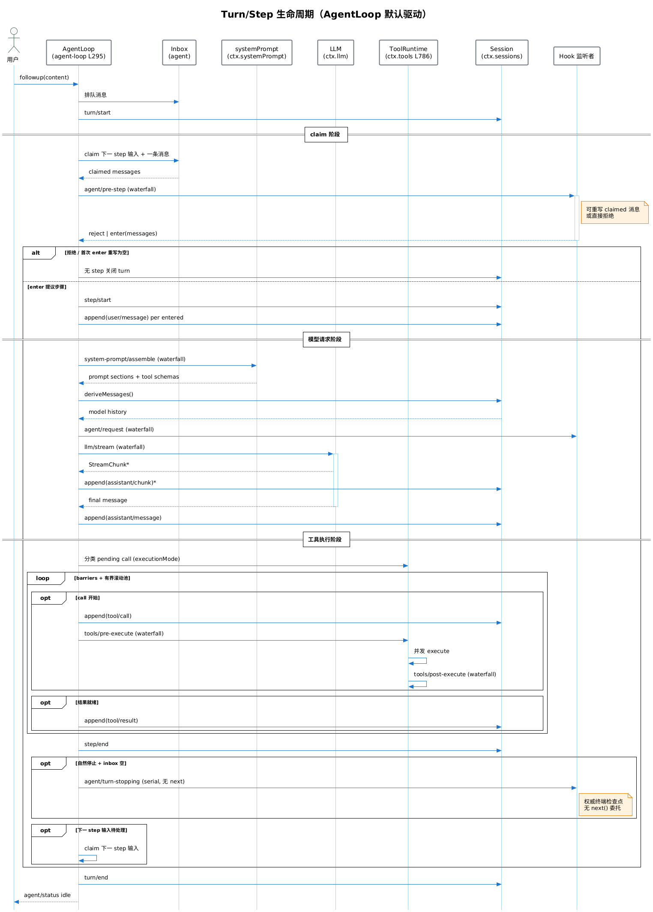

# core/agent-loop — 默认驱动

## 模块概述

`core/agent-loop` 实现 `Agent` 接口的默认驱动，编排 Turn/Step 生命周期。它是整个 Agent Harness 的「心脏」——驱动模型请求、工具执行、事件追加的循环。`ctx.agentLoop` 是其 ctx key。本模块是 **swappable** 的——扩展插件应依赖 `dsh-agent`（接口）而非具体 loop。

## 主要功能

1. **Turn/Step 生命周期编排**：`prepare()` 准备步骤 → 模型请求 → 工具执行 → 步结束。
2. **Agent 创建与管理**：`createAgent()` 创建 agent，`create()` 工厂方法。
3. **会话恢复**：`resume()` / `resumeWith()` 恢复会话继续运行。
4. **配置身份管理**：`restoreOrCreateConfigured()` / `waitForDrainingConfiguredIdentity()`。
5. **反应式循环**：`ReactLoopAgent`（`agent.ts` L63-495）提供反应式驱动变体。

## 目录结构

```
packages/core/agent-loop/src/
├─ index.ts          # AgentLoop 类 (L295-710), 配置, createAgent
├─ agent.ts          # ReactLoopAgent 类 (L63-495)
└─ (其他辅助模块)
```

## 核心流程

- [Turn/Step 生命周期时序图](./01-turn-step-sequence.puml) — 完整回合驱动流程



> ℹ️ 后处理步骤会在上方链接后自动插入 PNG 图片嵌入。

## 核心符号

| 符号 | 类型 | 位置 | 说明 |
|---|---|---|---|
| `AgentLoop` | Class | `index.ts` L295-710 | 默认驱动实现 |
| `AgentLoop/constructor` | Method | L318-381 | 构造 |
| `AgentLoop/prepare` | Method | L458-577 | 准备步骤（claim + pre-step） |
| `AgentLoop/create` | Method | L588-597 | 工厂 |
| `AgentLoop/createAgent` | Method | L605-621 | 创建 agent |
| `AgentLoop/setupAndPublish` | Method | L624-644 | 设置并发布 |
| `AgentLoop/resume` | Method | L652-658 | 恢复会话 |
| `AgentLoop/resumeWith` | Method | L661-709 | 带输入恢复 |
| `AgentLoop/restoreOrCreateConfigured` | Method | L406-427 | 恢复或创建配置身份 |
| `AgentLoop/waitForDrainingConfiguredIdentity` | Method | L430-450 | 等待排空 |
| `ReactLoopAgent` | Class | `agent.ts` L63-495 | 反应式循环变体 |
| `AgentLoopSettings` | Interface | `index.ts` L243-246 | 设置 |
| `PreparedAgent` | Interface | L149-157 | 已准备 agent |
| `ConfiguredAgentIdentities` | Interface | L202 | 配置身份 |

## Turn/Step 生命周期

一个 **step** = 一次模型请求 + 其调用的工具。一个 **turn** = 零或多个 step。

```
turn/start
  claim 下一 step 输入 + 一条排队消息
  装配 prompt sections + tool schemas
  -> agent/pre-step (waterfall)        拒绝 | enter(messages)
  step/start
  追加 entered messages 为 user/message
  从日志派生模型历史
  agent/request -> llm/stream -> assistant/chunk* -> assistant/message
  tool/call* -> tools/pre-execute -> tools/execute -> tools/post-execute -> tool/result*
  step/end
  -> agent/turn-stopping (serial, 无 next)
turn/end
```

## 事件域

| 事件 | 类型 | 说明 |
|---|---|---|
| `agent/inbox/*` | 实时 | 队列管理（spliced/inserted/claimed） |
| `agent/status` | 实时 | 状态变更（running/idle） |
| `agent/pre-step` | waterfall | 步前拦截，可重写/拒绝消息 |
| `agent/request` | waterfall | 请求构造 |
| `agent/request-error` | waterfall | 请求错误处理（重试/保留） |
| `agent/turn-stopping` | serial（无 next） | 回合结束权威检查点 |

## 技术栈

| 技术 | 用途 |
|---|---|
| TypeScript ESM | 实现 |
| Cordis | waterfall / serial 事件 |
| 事件溯源 | 状态从 SessionEvent 派生 |

## 依赖关系

### 依赖模块
- `core/session`（`ctx.sessions` 追加事件）
- `core/tools`（`ctx.tools` 工具调度）
- `core/system-prompt`（`ctx.systemPrompt` prompt 装配）
- `llm/llm`（`ctx.llm` 模型请求与流）
- `@deepseek-ai/cordis`

### 被依赖模块
- `bundle/headless`（headless 运行驱动）
- `acp/`（ACP server 驱动）
- `hooks/`（hook 桥接 agent 事件）

## 相关文档

- [系统架构 - Turn 流程](../../02-architecture/system-architecture.md#41-turnstep-请求处理流程)
- [Agent 生命周期](../../02-architecture/system-architecture.md#41-turnstep-请求处理流程)
