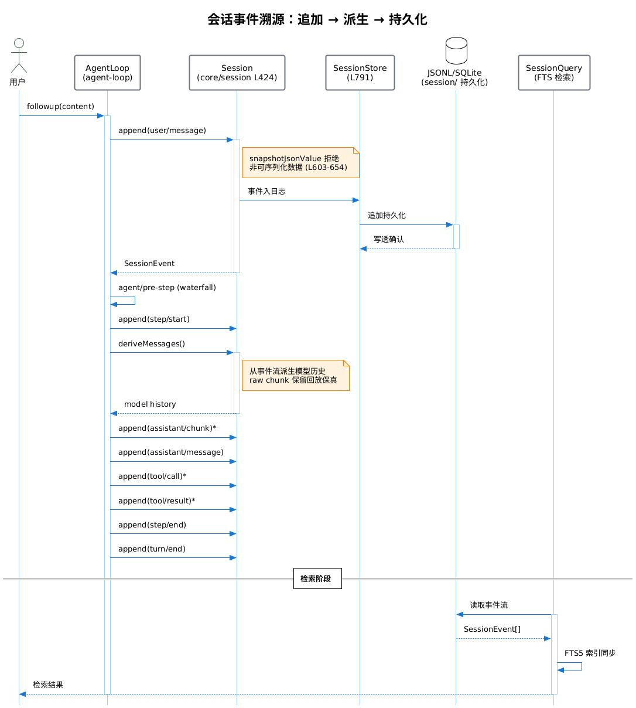
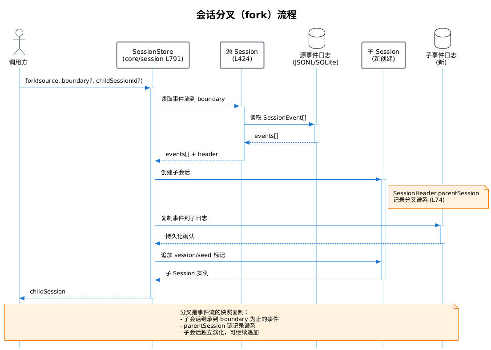

# core/session — 会话事件日志

## 模块概述

`core/session` 是 DeepSeek Harness 的产品 API 脊柱之一，提供追加只写的 `SessionEvent` 日志与内存存储。采用事件溯源（Event Sourcing）模式：会话状态是事件日志的派生物，所有模型可见内容必须可从日志重建。`ctx.sessions` 是其 ctx key。

## 主要功能

1. **事件追加与日志**：`Session.append()` 在源头用 `snapshotJsonValue` 拒绝非可序列化数据，保证耐久日志回放相同事件。
2. **模型历史派生**：`deriveMessages()` 从事件流派生模型可见历史；raw `assistant/chunk` 保留回放与 UI 保真。
3. **会话分叉**：`SessionStore.fork(source, boundary?, childSessionId?)` 从事件流分叉新会话。
4. **会话恢复**：从持久化日志恢复会话状态。
5. **事件类型体系**：`SessionEventMap` 声明合并扩展，13 个事件类型分四类。

## 目录结构

```
packages/core/session/src/
├─ index.ts          # Session 类 (L424-757), SessionStore 类 (L791-1154)
├─ types.ts          # SessionEventMap (L235-332), SessionHeader (L60-98), SessionEvent (L403-435)
├─ invariant.ts      # 会话不变式, SessionTrace
├─ preparation.ts    # SessionPreparation
├─ surface.ts        # SessionSurface
└─ py-types.ts       # Python SDK 类型
```

## 核心流程

- [事件追加与派生时序图](./01-event-sourcing-sequence.puml) — 事件追加 → 派生 → 持久化 → 检索
- [会话分叉时序图](./02-session-fork-sequence.puml) — fork 流程





> ℹ️ 后处理步骤会在上方链接后自动插入 PNG 图片嵌入。

## 核心符号

| 符号 | 类型 | 位置 | 说明 |
|---|---|---|---|
| `Session` | Class | `index.ts` L424-757 | 会话实例，`append` (L603-654) |
| `SessionStore` | Class | `index.ts` L791-1154 | 会话存储，含 `fork` |
| `SessionEventMap` | Interface | `types.ts` L235-332 | 事件类型体系（声明合并扩展） |
| `SessionHeader` | Interface | `types.ts` L60-98 | 会话头，含 `parentSession` |
| `SessionEvent` | Variable | `types.ts` L403-435 | 事件联合类型 |
| `CreateSessionOptions` | Interface | `types.ts` L105-121 | 创建会话选项 |
| `SessionForkError` | Class | `index.ts` L778-783 | 分叉错误 |
| `validateSessionHeader` | Function | `index.ts` L95-135 | 头校验 |

## 事件类型体系（SessionEventMap）

| 类别 | 事件 | 持久 | 说明 |
|---|---|---|---|
| **生命周期** | `turn/start`、`turn/end`、`step/start`、`step/end` | ✅ | Turn/Step 边界 |
| **模型可见表面** | `user/message`、`assistant/chunk`、`assistant/message`、`tool/call`、`tool/result` | ✅ | 模型请求可见内容 |
| **仅日志** | `session/seed` 等 | ✅ | 不影响模型历史 |
| **种子标记** | header/version 标记 | ✅ | 会话元数据 |

> 完整 13 类事件见 `types.ts` L235-332（AST 验证）。

## 技术栈

| 技术 | 用途 |
|---|---|
| TypeScript ESM | 实现 |
| Cordis | 插件上下文（`ctx.sessions`） |
| 事件溯源 | 状态派生自事件日志 |

## 依赖关系

### 依赖模块
- `@deepseek-ai/dsh-brand`、`@deepseek-ai/dsh-invariants`、`@deepseek-ai/dsh-llm`、`@deepseek-ai/dsh-scope`、`@deepseek-ai/dsh-typert-protocol`、`@deepseek-ai/cordis`

### 被依赖模块
- `core/agent-loop`（追加事件）、`session/`（持久化）、`session-query/`（检索）、`api/`（渲染）、`host/`、`client/`

## 相关文档

- [事件溯源功能说明](./event-sourcing.md)
- [数据架构](../../05-data-architecture/data-architecture.md)
