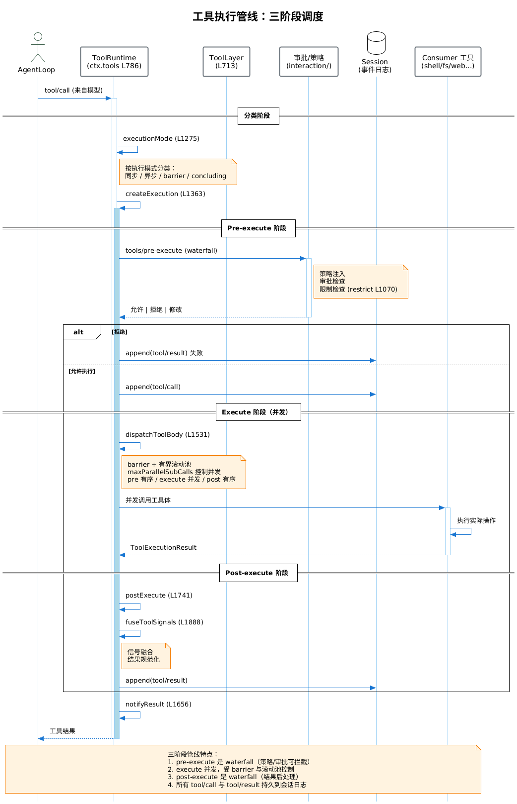

# 工具执行管线 - 子功能概览

## 功能简介

工具执行管线是 `core/tools` 的核心子功能，负责将模型发起的 `tool/call` 安全、有序、并发地执行并产出 `tool/result`。它采用**三阶段 waterfall + 有界滚动池**架构，在策略注入、并发控制、结果融合之间取得平衡。

## 支持的阶段/类型

1. **Pre-execute 阶段** — [详细说明](./01-pre-execute.md)
   - 策略注入、审批检查、限制检查
   - waterfall 事件，可拦截/修改/拒绝
   - 适用场景：权限控制、参数校验、审计

2. **Execute 阶段** — [详细说明](./02-execute.md)
   - 并发执行工具体
   - barrier 与有界滚动池控制
   - 适用场景：实际工具操作（shell/fs/web/skill）

3. **Post-execute 阶段** — [详细说明](./03-post-execute.md)
   - 结果后处理、信号融合
   - waterfall 事件
   - 适用场景：结果规范化、副作用记录、压缩

## 通用流程

```
tool/call (来自模型)
  -> ToolRuntime.executionMode 分类 (L1275)
  -> ToolRuntime.createExecution (L1363)
  -> [Pre] prepareExecution (L1462) + tools/pre-execute waterfall
     -> 审批/策略/限制 (interaction/, guard/)
  -> [Execute] dispatchToolBody (L1531) + tools/execute waterfall
     -> Consumer 工具体 (shell/fs/web...)
     -> barrier + 有界滚动池 (maxParallelSubCalls)
  -> [Post] postExecute (L1741) + tools/post-execute waterfall
     -> fuseToolSignals (L1888)
  -> notifyResult (L1656)
  -> append(tool/result)
```

详见 [执行管线时序图](../01-tool-execution-sequence.puml)。



## 核心接口

| 接口/符号 | 位置 | 说明 |
|---|---|---|
| `ToolExecutionInput` | `index.ts` L313-337 | 执行输入 |
| `ToolExecution` | L378-383 | 执行描述 |
| `ToolExecutionMode` | L343-345 | 执行模式枚举 |
| `ToolExecutionResult` | L579 | 执行结果 |
| `ToolExecutionSuccess` | L555-565 | 成功结果 |
| `ToolExecutionFailure` | L568-576 | 失败结果 |
| `PreToolDecision` | L587-590 | Pre 阶段决策 |
| `PostToolDecision` | L596-599 | Post 阶段决策 |
| `ToolRestriction` | L679-684 | 工具限制 |
| `CompiledToolRestriction` | L687-690 | 编译后限制 |
| `ToolGuard` | L710 | 守卫 |
| `FusedToolSignal` | L768-771 | 融合后信号 |

## 扩展机制

- **注册新工具**：`defineTool()`（`schema.ts` L544-616）定义 + `ToolRuntime.register()`（L1036-1061）注册。
- **注入策略**：监听 `tools/pre-execute` waterfall（如 `interaction/` 审批、`guard/` 超时）。
- **结果后处理**：监听 `tools/post-execute` waterfall。
- **限制工具**：`ToolRuntime.restrict()`（L1070-1097）添加限制。
- **守卫**：`ToolRuntime.guard()`（L1109-1115）+ `guardReason()`（L1118-1127）。

## 配置选项

| 选项 | 类型 | 默认值 | 说明 |
|---|---|---|---|
| `maxParallelSubCalls` | number | — | 最大并发子调用数 |
| `defaultMode` | ToolExecutionMode | — | 默认执行模式 |
| `layers` | ToolLayer[] | — | 工具分层 |
| `concludingExecutions` | — | — | 收尾执行集合 |
| `cancellationStates` | — | — | 取消状态映射 |
| `deferredContexts` | — | — | 延迟上下文 |

## 性能特点

- **并发执行**：execute 阶段并发，受 `maxParallelSubCalls` 上限。
- **barrier 协调**：前置 barrier 需等待，保证顺序依赖。
- **有界滚动池**：避免无限制并发导致资源耗尽。
- **信号融合**：`fuseToolSignals`（L1888-1915）合并多工具信号，减少冗余。
- **pre/post 有序**：保证策略与结果处理的确定性顺序。

## 注意事项

- Pre-execute 的 waterfall 决策是权威的——一个 block 则整体 block（restrictive merge）。
- 取消传播：`callerCancelled`（L1509-1514）→ `cancellationResult`（L1517-1524）。
- `serviceAsk`（L1688-1728）支持工具向用户提问（ask-user）。
- Code Mode 工具（`createRunCodeTool` `code-mode.ts` L293-672）是特殊的代码执行工具。
