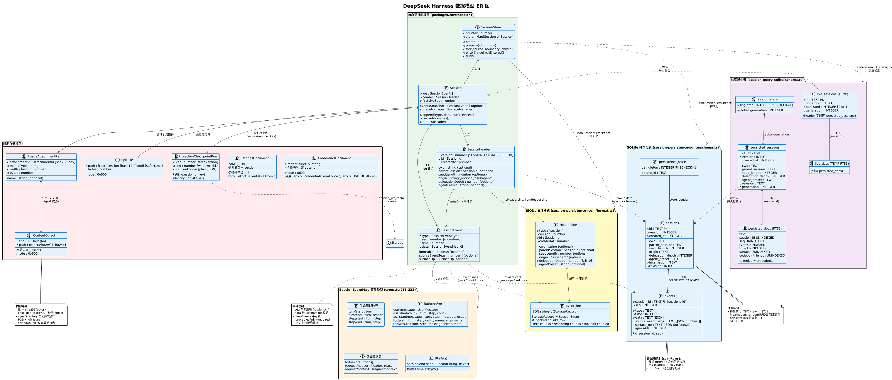
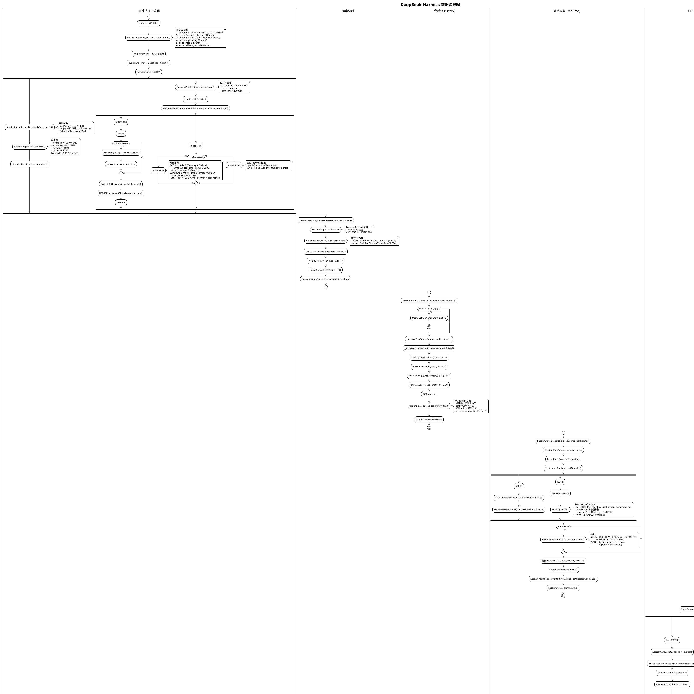
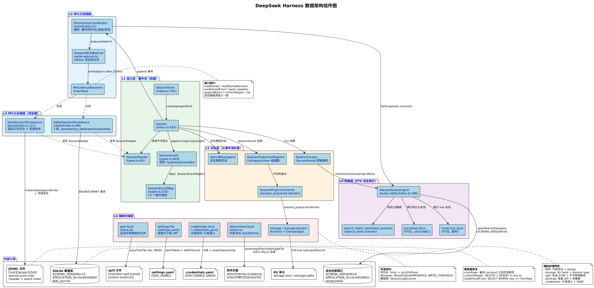

# 数据架构说明

> 本文档基于 AST 符号工具对源码符号验证生成。代码引用处的行号均来自符号工具验证。配套图：[数据架构组件图](./data-architecture.puml)、[数据模型 ER 图](./data-model-er.puml)、[数据流程图](./data-flow.puml)。

## 1. 概述

### 1.1 设计理念

DeepSeek Harness（`dsh`）的数据架构围绕三条核心原则展开：

| 原则 | 含义 | 体现 |
|---|---|---|
| **事件溯源（Event Sourcing）** | 会话状态是追加只写事件日志的派生物；事件是不可变事实，派生视图从事件流折叠而来。 | `Session.append` 仅追加；`deriveMessages` 从事件派生模型历史；投影（projection）以 `init/apply/view` 三函数折叠。 |
| **双后端持久化** | 同一事件日志可通过 JSONL 或 SQLite 后端持久化，二者实现同一 `PersistenceBackend` 接口，崩溃语义一致。 | `JsonlSessionPersistence`、`SqliteSessionPersistence` 均继承 `SessionPersistence` 并实现 `PersistenceBackend`。 |
| **Pre-release 无兼容承诺** | 项目处于 `0.1.0-rc.5` Developer Preview，无外部消费者，优先正确基础而非兼容垫片——schema 版本不匹配即拒绝，不做迁移。 | SQLite `SCHEMA_VERSION = 15` 不匹配即抛错；`SESSION_FORMAT_VERSION` 不匹配即 `SessionFormatUnsupportedError`。 |

### 1.2 数据层次

系统数据自顶向下分四层：

| 层 | 内容 | 代表符号 |
|---|---|---|
| **L1 事件流（权威）** | 追加只写的 `SessionEvent` 日志 | `Session.log`、`SessionEventMap` |
| **L2 派生视图** | 从事件流折叠出的模型历史、投影状态 | `Session.deriveMessages`、`SessionProjectionRegistry` |
| **L3 持久化后端** | 把事件流落到磁盘（JSONL/SQLite） | `PersistenceCoordinator`、`PersistenceBackend` |
| **L4 辅助存储** | 附件、设置、凭据、spill、投影缓存 | `attachment-local`、`settings-file`、`credentials-local`、`spill-local`、`session-projection-cache` |

只有 L1 是权威；L2~L4 都是派生或缓存，丢失后可从 L1 重建。

## 2. 主数据库设计（SQLite 持久化后端）

SQLite 后端把会话头与事件映射为行，委托 `PersistenceCoordinator` 编排写路径。代码：`packages/session/session-persistence-sqlite/src/schema.ts`、`packages/session/session-persistence-sqlite/src/index.ts`。

### 2.1 数据库连接与所有权

- **打开**：`openDatabase(path, journalMode)`（`schema.ts:81`）以 `BEGIN IMMEDIATE` 持写锁校验所有权，避免其他连接在检查与初始化之间抢占 schema。
- **所有权校验**（`schema.ts:105-114`）：
  - `user_version = 0` 且 (`application_id ≠ 0` 或存在用户对象) → 拒绝（无版本 schema 或外部 identity）
  - `user_version ≠ 0` 且 `≠ SCHEMA_VERSION` → 拒绝不兼容版本
  - `user_version = SCHEMA_VERSION` 且 `application_id ≠ SESSION_PERSISTENCE_SQLITE_APPLICATION_ID` → 拒绝
- **常量**（`schema.ts:20-23`）：
  - `SCHEMA_VERSION = 15`（monotonic，破坏性变更时 bump）
  - `SESSION_PERSISTENCE_SQLITE_APPLICATION_ID = 0x44534850`（ASCII "DSHP"）
- **Journal Mode**（`schema.ts:70`）：`'wal' | 'delete' | 'truncate' | 'persist'`；默认 `wal`，回滚日志模式用于 WAL 共享内存不工作的网络挂载；排除 `memory`/`off`（静默丢弃日志耐久性）。
- **写入争用**：后端不设 busy timeout，不重试 locked-database 错误——其他连接持写事务时操作立即拒绝。

### 2.2 核心表结构

后端在初始化时创建三张 STRICT 表（`schema.ts:116-147`）：

```sql
-- 存储身份单例（store identity singleton）
CREATE TABLE IF NOT EXISTS persistence_state (
  singleton INTEGER PRIMARY KEY CHECK (singleton = 1),
  store_id  TEXT NOT NULL
) STRICT;

-- 会话元数据（out-of-log header）
CREATE TABLE IF NOT EXISTS sessions (
  id               TEXT PRIMARY KEY,
  version          INTEGER NOT NULL,            -- SESSION_FORMAT_VERSION
  created_at       INTEGER NOT NULL,
  cwd              TEXT,
  parent_session   TEXT,                        -- 分叉谱系
  seed_length      INTEGER,                     -- 继承的种子事件数
  origin           TEXT,                        -- 'subagent' 或 null
  delegation_depth INTEGER,
  agent_preset     TEXT,
  incarnation      TEXT NOT NULL,               -- 物化时分配的稳定身份
  revision         INTEGER NOT NULL             -- 单调递增的日志变更令牌
) STRICT;

-- 事件行（1:1 映射 SessionEvent）
CREATE TABLE IF NOT EXISTS events (
  session_id        TEXT NOT NULL REFERENCES sessions(id) ON DELETE CASCADE,
  seq               INTEGER NOT NULL,           -- 会话内单调序列号
  type              TEXT NOT NULL,
  time              INTEGER NOT NULL,
  data              TEXT NOT NULL,              -- JSON 文本
  source_event_seqs TEXT,                       -- JSON number[] 或 null
  surface_op        TEXT,                       -- JSON SurfaceOp 或 null
  ignorable         INTEGER,                    -- 1 iff ignorable: true
  PRIMARY KEY (session_id, seq)
) STRICT
```

**关键设计**：

- **惰性物化**：`sessions` 行仅在首次 `append` 时写入（`writeRow`，`index.ts:385`），所以「已创建但从未追加」的会话无行、不出现在 `list` 中——与 JSONL 后端「无文件直到首次追加」语义一致。
- **`incarnation`**：物化时分配的 `randomUUID()`，作为 `storeIdentity` 的一部分，让 `readStoredRevision` 区分同一 id 下的不同生命周期。
- **`revision`**：每个变更事务 `+1`（`index.ts:296`），让 `SessionPersistenceRevision` 表达「同一身份下的精确前缀」。
- **`ON DELETE CASCADE`**：seam 无删除 API；行累积直到外部带外清理时级联删除事件。
- **STRICT 表**：所有列类型严格校验，避免 SQLite 弱类型导致的脏数据。

### 2.3 事务边界

- **`appendBatch`**（`index.ts:284-302`）：`BEGIN` → `writeRow`（若未物化）→ 逐行 `INSERT` 事件 → `UPDATE sessions SET revision = revision + 1` → `COMMIT`。物化写与首批事件原子提交，崩溃不会留下「物化但空」的会话。失败 `ROLLBACK`，存储日志保持未触碰。
- **`commitRepair`**（`index.ts:309-338`）：`BEGIN` → `DELETE FROM events WHERE seq >= tornMarker`（截断撕裂尾）→ `INSERT closers`（合成关闭器）→ `UPDATE revision` → `COMMIT`。一次事务完成崩溃修复，COMMIT 后存储行 == 平衡日志。
- **`loadStoredFrom`**（`index.ts:225-238`）：seek-capable 后缀读，`SELECT ... WHERE seq >= fromSeq ORDER BY seq`，让 `readFrom` 随后缀规模（而非整日志规模）扩展。

### 2.4 撕裂尾修复（scanRows）

`scanRows`（`schema.ts:232-270`）找出有序事件行的保留前缀：

1. **Pass 1**：解析每行 `data`；JSON 解析失败的行标记为洞（hole）。
2. **找最后 `turn/end`**：从末尾向前扫描，定位最后一个有效的 `turn/end`。
3. **保留前缀**：连续前缀（含完整的中断 turn）；通过最后 `turn/end` 之前的洞抛错（已提交损坏），之后的洞停止（容忍撕裂尾）。
4. **`tornFrom`**：保留前缀之后的第一 seq，作为 `commitRepair` 的物理删除起点。

这与 JSONL 后端的 `SessionLogScanner` 给出**相同**的崩溃尾语义。

## 3. JSONL 会话日志设计

JSONL 后端把会话头与事件存为每会话一个追加只写文件，委托 `PersistenceCoordinator` 编排。代码：`packages/session/session-persistence-jsonl/src/format.ts`、`packages/session/session-persistence-jsonl/src/index.ts`、`packages/session/session-persistence-jsonl/src/win32.ts`。

### 3.1 文件布局

每会话一个目录，按项目分组（`format.ts:176-208`）：

```
<root>/                            -- 配置的会话根目录
├── _no-cwd/                       -- cwd 未定义的会话
│   └── <encoded-session-id>/
│       └── session.jsonl.zstd
└── --<project-key>--/             -- cwd 编码为可读目录键
    └── <encoded-session-id>/
        └── session.jsonl.zstd     -- 默认 Zstandard 压缩
```

- **`encodeSegment`**（`format.ts:121-136`）：把任意字符串单射编码为安全路径段。`SessionId` 是未校验的 branded string，必须先编码才能用于路径——中和 `../`、绝对路径、NUL、分隔符；`~` 转义为 `~XXXX`，保证可逆。
- **`projectKey`**（`format.ts:147-167`）：把项目路径编码为可读目录键，分隔符变 `-`，不安全码元用 `~XXXX`，截断到 251 字节，前后加 `--` 边界。
- **`logPath`**（`format.ts:201-208`）：`sessionDir/projectDir/encodeSegment(id)` + `session<suffix>`。
- **物理编码**（`format.ts:17-26`）：默认 `zstd`（`.jsonl.zstd`），可选 `none`（`.jsonl`）；切换编码需独立/全新根，预发布格式无迁移。

### 3.2 文件格式

首行是头记录，后续每行一个事件（`format.ts:33-44, 221-224`）：

```jsonl
{"type":"session","version":0,"id":"session-1","createdAt":1234567890,"cwd":"/work","delegationDepth":0}
{"type":"turn/start","seq":0,"time":1234567890,"data":{"turn":0}}
{"type":"user/message","seq":1,"time":1234567891,"data":{...},"sourceEventSeqs":[],"surfaceOp":"append"}
...
```

- **`HeaderLine`**（`format.ts:33-44`）：`type: 'session'` 标记，让读者从头行中区分出事件行；`delegationDepth` 总是数字（默认 0）；拒绝已退休的 `sandboxMode`/`approvalPolicy` 字段（`format.ts:72-74`）。
- **`eventLines`**（`format.ts:221-224`）：批次序列化为 JSONL 文本（无尾换行）。`packChunks` 开启时，连续 `assistant/chunk` delta 事件打包为 `text-chunks`/`reasoning-chunks`/`tool-call-chunks` 存储行（无损，实测约 60% 压缩）；关闭则一事件一行，与打包前布局字节相同。**读取布局无关**——`scanLog` 总是解码行，开关只影响新写字节。
- **`SESSION_FORMAT_VERSION`**：事件词汇表版本，写入头行；后端拒绝任何其他版本（无迁移）。

### 3.3 写透发布（Write-Through Publication）

**POSIX 路径**（`index.ts:529-569`）：

1. `mkdir -p` 创建 root/project/session 三级目录，每级 `mode: 0o700`。
2. 每级创建后 `syncDirPosix`（`index.ts:636-643`）—— `open(dir, 'r')` + `handle.sync()` fsync 父目录元数据。
3. `writeSyncedTempFile`（`index.ts:606-616`）：`open(tmp, 'wx', 0o600)` → `writeFile` → `handle.sync()` fsync 文件数据。
4. **`link()` 发布**（`index.ts:549`）：用 `link(tmp, finalPath)` 而非 `rename()`——`link` 在最终路径已存在时 `EEXIST` 失败，两进程并发物化同一 id 不会互相覆盖。
5. `syncDirPosix(dir)` fsync 目录，让新 link 元数据 crash-durable。
6. `rm(tmp)` 最佳努力清理临时硬链接，失败不影响已发布的日志。

**Windows 路径**（`win32.ts`、`index.ts:573-591`）：

Windows 不通过 Node 暴露父目录 fsync 契约，改用原生耐久命名空间原语（`win32.ts:1-12`）：

- **`publishNewFileWin32`**（`win32.ts:116-120`）：`MoveFileExW(existing, replacement, MOVEFILE_WRITE_THROUGH)`（`MOVEFILE_WRITE_THROUGH = 0x8`）。目的地必须不存在；移动必须同卷（无 copy fallback）。
- **`ensureDurableDirectoryWin32`**（`win32.ts:130-142`）：逐级创建——每级先用 `mkdtemp` 创建随机 staging 兄弟，再 `publishNewFileWin32` 移到最终名；与另一创建者的竞争仅在验证赢家是目录后才接受。
- **延迟加载 Koffi**（`win32.ts:42-51`）：非 Windows 进程永不加载 `koffi`，避免不必要的原生依赖。

### 3.4 追加写与回滚

`appendLines`（`index.ts:651-679`）：

1. `open(path, 'a')` 以追加模式打开。
2. 记录 `before = handle.stat().size`。
3. `writeFile(content)` + `handle.sync()` fsync。
4. **失败回滚**（`index.ts:667-675`）：关闭句柄后 `rollbackAppend`（`index.ts:681-689`）`truncate(path, before)` + `sync()`，恢复到追加前大小——因为不变的游标会重试批次，留下部分字节会制造重复 seq。
5. 双重失败抛 `AggregateError`。

### 3.5 增量扫描与撕裂修复

`SessionLogScanner`（`format.ts:272-378`）增量扫描完整 JSONL 事件记录：

- **构造**：从一行完整头记录开始（`parseHeaderRecord`，`format.ts:249-264`），先 `refuseForeignFormatVersion` 拒绝异类格式版本，再 `isHeaderLine` 结构校验。
- **`write(chunk)`**（`format.ts:297-323`）：按 `\n` 分割，跨 chunk 的不完整记录用 `fragments` 缓冲拼接；只对完整记录解码 UTF-8。
- **`consumeEventLine`**（`format.ts:347-377`）：解码一行，更新连续前缀；遇 `turn/end` 时若有未抛的 issue 则抛出（已提交损坏）；seq 间隙在已提交区抛错，在撕裂尾停止。
- **`finish`**（`format.ts:341-344`）：忽略无尾换行的最终记录（撕裂尾），返回头、连续事件前缀、安全截断字节偏移。
- **`scanLog`**（`format.ts:388-394`）：完整缓冲兼容包装，先单独取头记录再委托给 scanner。
- **`parseHeaderMeta`**（`format.ts:404-413`）：仅解析头行——`list()` 用它读元数据而无需解析整日志，让会话选择器随会话数（而非每会话大小）扩展。

## 4. 核心数据模型

核心数据模型在 `packages/core/session/src/types.ts` 与 `packages/core/session/src/index.ts`。

### 4.1 SessionEventMap 事件类型体系

`SessionEventMap`（`types.ts:235-332`）是会话事件词汇表，声明合并可扩展。13 个事件类型分四类：

#### 4.1.1 生命周期边界（turn/step）

| 事件 | 数据 | 说明 |
|---|---|---|
| `turn/start` | `{ turn: number }` | 在 loop claim 排队输入或运行 pre-step 前打开 turn。拒绝/空输入/取消/失败可能无 step 关闭它。 |
| `turn/end` | `{ turn: number; reason: TurnEndReason }` | 关闭 turn。loop 在 turn 边界**不** await flush——`dsh-session-checkpoint-policy` 拥有每请求耐久检查点。成功提交 turn；拒绝实时上报不阻塞后续工作。 |
| `step/start` | `{ turn: number; step: number }` | 打开 turn 内的 step（一次模型调用 + 其请求的工具执行）。 |
| `step/end` | `{ turn: number; step: number }` | 关闭 step。 |

#### 4.1.2 模型可见表面（surface events）

| 事件 | 数据 | 说明 |
|---|---|---|
| `user/message` | `UserMessage` | 用户角色消息：直接人类 prompt、合成 `agent.inject()` 上下文（文件变更通知、子目录 AGENTS.md、skill 内容、cron 通知）、或输入的目标延续回合。三者都逐字投影 `content`；`source` 区分。 |
| `assistant/chunk` | `{ turn; step; chunk: StreamChunk }` | 原始流 chunk——token 级回放保真。 |
| `assistant/message` | `{ turn; step; message: AssistantMessage; usage?: TokenUsage }` | 一个 step 的组装助手消息（派生历史用此）。携带 step 的 `usage`——模型输出与记账同行，无独立 usage 记录。适配器未上报时 `usage` 缺失。 |
| `tool/call` | `{ turn; step; callId: CallId; name: string; arguments: string }` | 模型请求一次工具调用：`name` + 模型原样产生的未解析 `arguments` JSON 串。`callId` 配对 `tool/result`。 |
| `tool/result` | `{ turn; step; message: ToolResultMessage; error?: {name; code}; meta?: JsonValue }` | 工具调用的模型面结果。`meta` 对核心不透明（产出工具拥有其形状并在 `presentResult` 读回），但**必须** JSON 可序列化——`Session.append` 用 `isJsonValue` 运行时校验所有事件数据，非可序列化 `meta` 在源头拒绝，耐久日志在回放时重现相同卡片。 |

#### 4.1.3 仅日志状态（log-only）

| 事件 | 数据 | 说明 |
|---|---|---|
| `todo/write` | `{ todos: TodoItem[] }` | 整列表快照；回放时最新写胜出。仅日志 UI 状态，**从不**派生历史。 |
| `request/header` | `{ header: EpochHeader; reason: RequestHeaderReason }` | 下次请求的完整头，在 step 内分发前追加。仅日志；最新快照重建请求头。 |
| `request/context` | `RequestContext` | 下次请求的路由元数据，仅在路由或容量变更时记录。不参与请求重建或头相等。 |

#### 4.1.4 生命周期种子标记

| 事件 | 数据 | 说明 |
|---|---|---|
| `session/end-seed` | `Record<string, never>` | 标记构造器种子结束。此事件之前有更小 seq 的事件来自种子（resume/fork/replay）；此生命周期不产出它们。仅日志事件，是 `Session.firstLiveSeq` 的耐久投影。载荷为空——位置与 `time` 承载含义。定位存储历史中的**最后一个**。已以它结尾的种子不重标记，所以重开未触碰会话不增长日志。`Session` 构造器是唯一合法写者。 |

### 4.2 SessionHeader（会话头）

`SessionHeader`（`types.ts:60-98`）是会话的不可变元数据：

| 字段 | 类型 | 说明 |
|---|---|---|
| `version` | `readonly number` | 磁盘格式版本，创建时从 `SESSION_FORMAT_VERSION` 盖戳。后端加载时拒绝任何其他版本（无迁移）。 |
| `id` | `readonly SessionId` | 会话 id（镜像 `Session.id`）。 |
| `createdAt` | `readonly number` | 非负安全整数 Unix epoch 毫秒。 |
| `cwd` | `readonly string?` | 创建会话时的绝对工作目录。 |
| `parentSession` | `readonly SessionId?` | 分叉源（种子谱系）。 |
| `seedLength` | `readonly number?` | 通过种子继承的前导事件数；持久化此边界让 resume/replay 区分父历史与子工作。 |
| `origin` | `readonly 'subagent'?` | 子 agent 创建时的粗粒度产品分类——展示元数据，**不**证明子可延续。 |
| `delegationDepth` | `readonly number?` | 委派深度：顶层缺省（零），子 agent 为父深度 + 1。持久化让递归预算穿越 restart/resume——纯运行时深度会让 resumed 子重置为顶层。 |
| `agentPreset` | `readonly string?` | 此会话 agent 组合自的 preset id。耐久因为 preset 决定会话的工具与 prompt——resume 恢复不同组合会重放模型无法再行动的历史。 |

### 4.3 SessionEvent（事件信封）

`SessionEvent`（`types.ts:403-435`）是事件信封类型：

```typescript
type SessionEvent<T extends SessionEventType = SessionEventType> = {
  [K in SessionEventType]: {
    type: K
    seq: number                    // 会话内单调序列号
    time: number                   // Unix epoch 毫秒
    data: SessionEventMap[K]
    ignorable?: true               // 读者可不识别时安全跳过
  } & (K extends SurfaceEventType ? {
    sourceEventSeqs?: number[]     // 引用的更早事件 seq（如 chunk 组成 message）
    surfaceOp?: SurfaceOp          // 事件如何进入表面
  } : object)
}[T]
```

**`ignorable` 语义**（`types.ts:412-421`）：缺省意味着 required——读者遇不识别 `type` 且无此标记时**必须**拒绝重建会话，而非静默丢弃事件（不识别的 required 事件可能改变后续日志解释）。写者仅在纯信息记录（丢失不影响重建）上设 `true`；默认 required 让遗忘的标记过度拒绝（不便）而非静默恢复被掏空的会话。

### 4.4 Session 类

`Session` 类（`index.ts:424-757`）是事件日志的运行时持有者：

| 成员 | 行号 | 职责 |
|---|---|---|
| `log: SessionEvent[]` | L425 | 追加只写的事件数组（权威源）。 |
| `surfaceManager` | L427 | 表面管理器，`validateNext` 校验下一事件合法性。 |
| `header: SessionHeader` | L442 | 不可变会话头。 |
| `firstLiveSeq` | L471 | 此生命周期产生的第一个 seq（种子边界）。 |
| `eventsSnapshot` | L550 | 缓存的事件快照（ invalidated on append）。 |
| `append` | L603-654 | 追加事件（见 4.5）。 |
| `requestHeader` | L669-679 | 从日志派生下次请求头。 |
| `requestContext` | L690-698 | 从日志派生请求上下文。 |
| `deriveMessages` | L725-746 | 从事件派生模型历史（核心派生视图）。 |

### 4.5 Session.append 详解

`Session.append`（`index.ts:603-654`）是事件入口，体现「模型可见即已记录」原则：

1. **`snapshotJsonValue(data)`**（L617-620）：深快照 + JSON 可序列化校验。非可序列化数据抛 `session event "..." carries non-JSON-serializable data`——在源头拒绝，保证耐久日志能回放相同事件。
2. **`assertSupportedRequestHeader`**（L623）：校验请求头事件合规。
3. **`snapshotJsonValue(surfaceMetadata)`**（L625-629）：表面元数据同样快照+校验。
4. **重入保护**（L621-622, L635-652）：`entry.appending` 标记防止追加时重入；`finally` 块清理标记并在请求 detach 时执行。
5. **`deepFreeze`**（L627）：事件对象深冻结，保证不可变。
6. **`surfaceManager.validateNext`**（L633）：表面管理器校验事件序列合法性。
7. **`log.push`**（L641）：追加到权威日志。
8. **`eventsSnapshot = undefined`**（L642）：失效快照缓存。
9. **回调分发**（L637-640, L643-647）：通过 `collectSessionCallbacks` 收集 `session/event` 监听器并 `invokeContainedSessionObservers` 触发。

### 4.6 SessionStore 类

`SessionStore` 类（`index.ts:791-1154`）管理多个 Session：

| 方法 | 行号 | 职责 |
|---|---|---|
| `create` | L829-840 | 创建新会话。 |
| `prepare` | L862-888 | 准备会话（新建或从持久化恢复）。`seedSource: 'persistence'` 走 `Session.fromRestore`。 |
| `enter` | L912-946 | 进入会话（live 注册）。 |
| `detachEntered` | L949-958 | 分离已进入会话。 |
| `announce` | L967-995 | 公告会话事件。 |
| `flush` | L1021-1038 | flush 持久化。 |
| `fork` | L1080-1094 | 分叉会话（见 6.2）。 |
| `_forkSeed` | L1096-1137 | 构造分叉种子。 |
| `liveEntryFor` | L1041-1047 | 获取 live 条目。 |
| `get` / `list` | L1054-1064 | 按 id 取 / 列举会话。 |

## 5. 数据关系图（ER 图说明）

详见 [data-model-er.puml](./data-model-er.puml)。核心实体关系：



```
SessionHeader 1───* SessionEvent       （头 → 事件流）
SessionEvent   *───1 SessionEventMap[K] （信封 → 类型化载荷）
Session        1───1 SessionHeader      （运行时 → 头）
SessionStore   1───* Session            （store → 会话集合）
Session        1───* SessionEvent       （会话 → 日志）

持久化层（SQLite）：
sessions 1───* events     （ON DELETE CASCADE）

持久化层（JSONL）：
HeaderLine 1───* event lines （首行 → 事件行）

派生层：
SessionEvent *───1 SurfaceNode   （表面事件 → 表面节点）
Session      1───* ProjectionSnapshot （会话 → 投影快照）

辅助存储：
Session      1───* AttachmentRef      （会话 → 附件引用）
AttachmentRef *───1 ContentObject     （引用 → 内容寻址对象 sha256:hex）
Session      1───* SpillFile          （会话 → spill 文件）
```

## 6. 数据流

详见 [data-flow.puml](./data-flow.puml)。



### 6.1 事件追加→派生→持久化→检索

```
[agent loop]
   │ produce event
   ▼
Session.append(type, data, surfaceIntent?)
   │ snapshotJsonValue(data)  ←── JSON 可序列化校验
   │ deepFreeze(event)
   │ surfaceManager.validateNext(event)
   │ log.push(event)           ←── 权威日志追加（内存）
   │ session/event 回调分发
   ▼
[SessionWriteBehind.enqueue(event)]   ←── 持久化协调器订阅
   │ structuredClone(event)
   │ pending.push(event)
   │ armTimer(maxDelayMs=200)
   ▼
[deadline or flush]
   │ startWrite(batch)
   ▼
PersistenceBackend.appendBatch(meta, events, isMaterialized)
   ├── SQLite: BEGIN → writeRow? → INSERT events → UPDATE revision → COMMIT
   └── JSONL:  materialize? | appendLines (open 'a' → writeFile → fsync → rollback on fail)
   ▼
[SessionProjectionRegistry.apply(state, event)]  ←── 投影驱动
   │ init/apply/view 纯函数折叠
   ▼
[SessionProjectionCache]  ←── 节流写后缓存
   │ writeEveryEvents / writeIntervalMs / turn/end / disposal 触发
   │ fail-soft 写入 storage domain session_projcache
   ▼
[SessionQueryEngine]  ←── FTS 索引派生
   │ SessionCorpus.listSessions / load / projectMany
   │ live-preferred：live session 优先于 persisted
   ▼
SqliteSessionQueryEngine.searchSessions / searchEvents
   ├── temp.live_docs (FTS5)        ←── live 会话
   └── persisted_docs (FTS5)        ←── 持久化会话
```

### 6.2 会话分叉（fork）数据流

`SessionStore.fork`（`index.ts:1080-1094`）：

```
fork(source, boundary?, childSessionId?)
   │ childSessionId 已存在 → SESSION_ALREADY_EXISTS
   │ _resolveForkSource(source)     ←── 解析为 live Session
   │ _forkSeed(liveSource, boundary) ←── 取种子事件（到 boundary 或末尾）
   ▼
create(childSessionId, {
   seed,                            ←── 父事件前缀（深拷贝）
   meta: {
     cwd: liveSource.header.cwd,
     parentSession: liveSource.id,  ←── 谱系
     seedLength: seed.length,       ←── 种子边界
   }
 })
   ▼
Session.create(id, seed, header)
   │ log = [...seed]                ←── 种子事件成为子日志前缀
   │ firstLiveSeq = seed.length     ←── 种子边界
   ▼
首次 append → session/end-seed 标记种子结束
   │ 后续事件是子生命周期产出
```

**关键点**：种子事件被深拷贝，父子日志独立；`parentSession` + `seedLength` 让 resume/replay 区分父历史与子工作；`session/end-seed` 是耐久投影，让冷读识别种子边界。

### 6.3 会话恢复（resume）数据流

```
SessionStore.prepare(id, { seedSource: 'persistence' })
   │ Session.fromRestore(id, seed, meta)
   ▼
PersistenceCoordinator.load(id)
   │ PersistenceBackend.loadStored(id)
   ├── SQLite: SELECT sessions row + events ORDER BY seq → scanRows
   └── JSONL:  readFile → scanLog (header + SessionLogScanner)
   │ tornMarker? → commitRepair (截断撕裂尾 + 合成关闭器)
   ▼
返回 StoredPrefix { meta, events, revision }
   │ adoptSessionEvent(events)
   ▼
Session 构造器
   │ log = events
   │ firstLiveSeq = 最后一个 session/end-seed 位置
   ▼
live 注册 → SessionStore.enter
```

### 6.4 session-query FTS 检索流程

`SqliteSessionQueryEngine`（`session-query-sqlite/src/index.ts:196`）维护两个 FTS5 索引：

```
[Observation]                      [Indexing]
   │                                  │
   ├── live sessions                  │
   │   (SessionCorpus.listSessions)   │
   │   → temp.live_sessions           │
   │   → temp.live_docs (FTS5)        │
   │                                  │
   └── persisted sessions             │
       (Persistence.listSnapshots)    │
       → 比对已索引 revision           │
       → 变更则 inspectPersisted       │
         → buildSessionEventSearchDocuments
         → persisted_sessions         │
         → persisted_docs (FTS5)      │
                                      ▼
[Query]
   │ normalizeSessionRequest / normalizeEventRequest
   │ buildSessionWhere / buildEventWhere  ←── 参数化 SQL 片段
   │ assertFts5OuterPredicateCount (≤14)
   │ assertPortableBindingCount (≤32766)
   ▼
SELECT ... FROM live_docs/persisted_docs
  WHERE <filters> AND docs MATCH ?
  ORDER BY ... LIMIT ? OFFSET ?
   ▼
makeSnippet (FTS5 highlight, \uFDD0/\uFDD1 标记)
   ▼
SessionSearchPage / SessionEventSearchPage
```

**关键设计**：
- **live-preferred corpus**：`SessionCorpus`（`corpus.ts:32`）优先用 live session 快照，避免可选后端故障让当前内存历史不可读。
- **disposable derived index**：`SESSION_QUERY_SQLITE_SCHEMA_VERSION = 8` 不匹配即 `resetDerivedSchema` 原地丢弃重建——派生索引可随时重建，无迁移负担。
- **FTS5 tokenizer**：`unicode61`（`schema.ts:135`），跨语言支持。
- **外谓词预算**：`SQLITE_FTS5_OUTER_PREDICATE_LIMIT = 14`（`query.ts:30`），防止 FTS5 规划器超预算。
- **host 参数上限**：`SQLITE_PORTABLE_VARIABLE_LIMIT = 32766`（`query.ts:27`），跨平台 SQLite 兼容。

## 7. 辅助存储

### 7.1 附件内容寻址存储（attachment-local）

代码：`packages/attachment/attachment-local/src/store.ts`。**内容寻址**（content-addressed）设计：

- **ID 模式**（`store.ts:19`）：`/^sha256:([a-f0-9]{64})$/`，附件 id 是内容的 sha256。
- **对象路径**（`store.ts:36-38`）：`<root>/objects/<sha256前2位>/<sha256>`，按前 2 位分桶避免单目录爆炸。
- **保存流程**（`saveImageFile`，`store.ts:136-194`）：
  1. `validateImageFile` 校验字节数与解码（`store.ts:63-68`）。
  2. `inspectMetadata` 探测图像元数据，校验声明类型与字节匹配（`store.ts:46-55`）。
  3. `sha256 = digest(data)`。
  4. `ensureDurableHome` + `ensureDurableDirectory` 建立 DSH_HOME 耐久边界（`store.ts:100-127`）——每个进程独立证明，观察到的目录不等于已耐久。
  5. `open(tmp, O_CREAT|O_EXCL|O_WRONLY, 0o600)` 独占创建临时文件。
  6. `writeFile` + `handle.sync()` fsync 数据。
  7. `link(tmp, target)` 硬链接发布——`EEXIST` 时读现有文件校验 digest（dedup 路径），不匹配抛 `ATTACHMENT_CORRUPT`。
  8. `syncDirectory(bucket)` + `syncDirectory(objects)` fsync 目录条目，关闭并发桶创建窗口。
  9. `unlink(tmp)` 清理临时。
- **读取流程**（`readImageFile`，`store.ts:204-231`）：读 + `digest` 校验 + `probeImage` 重派生头字段（不重复光栅解码，避免历史回放时的每请求像素放大）。
- **目录 fsync**（`syncDirectory`，`store.ts:76-87`）：POSIX `open(dir, O_RDONLY)` + `handle.sync()`；Windows 跳过（NTFS 元数据日志拥有条目耐久性）。
- **版本化根**：`DSH_HOME/attachments/v1`，预留版本演进。

### 7.2 存储 Hub（storage）

代码：`packages/storage/storage/src/backend.ts`、`packages/storage/storage-domain/src/spec.ts`。**KV 面向后端**的通用存储：

- **`StorageBackend`**（`backend.ts:17-27`）：拥有一个介质，暴露可选 `kv` facet 与 `close`。
- **`KvFacet.open(descriptor)`**（`backend.ts:42`）：打开一个单元，介质无痕迹时创建。
- **`KvUnit`**（`backend.ts:66-104`）：
  - `loadAll()`：读全快照（所有表记录 + global singleton）。
  - `putRecord(table, key, value)`：耐久 upsert（覆盖语义）。
  - `deleteRecord(table, key)`：耐久删除（幂等，缺键 no-op）。
  - `setGlobal(value)`：写 global singleton（仅当 `hasGlobal`）。
  - `close()`：排空在飞写入并释放。
  - **不序列化并发写**——写顺序是调用者责任（domain 层每单元一条写链）；只保证单调用在介质上原子且解析后耐久。
- **`UNIT_NAME_RE`**（`backend.ts:10`）：`/^[a-z][a-z0-9_]*$/`，单元/表名安全作为文件名与 SQL 标识符段。
- **`DomainSpec`**（`spec.ts:35-44`）：`name` + `version` + `global?` + `tables`。`defineDomain`（`spec.ts:79-98`）在模块加载时校验：名不匹配 `UNIT_NAME_RE`、版本非非负整数、global schema 接受 `null`（`null` 是「从未写」哨兵）都抛错。
- **后端实现**：`storage-json`（YAML/JSON 文件）、`storage-sqlite`（SQLite 表）。

### 7.3 Spill 存储（spill-local）

代码：`packages/spill/spill-local/src/store.ts`。**会话作用域临时文件**存储工具结果溢出：

- **`privateRoot`**（`store.ts:27-30`）：`mkdtempSync(join(tmpdir(), 'dsh-spill-'))`，私有（0700）每进程目录。可预测的世界可读路径会让其他本地用户读 spilled 工具输出或预创建符号链接；`mkdtemp` 给不可预测后缀。
- **`encodeSegment`**（`store.ts:48-63`）：镜像 JSONL 路径编码器，但保留空名策略（`""` → `"~"`）本地化。
- **`sessionDir`**（`store.ts:73-76`）：`<root>/session-<sha256(sessionId).slice(0,12)>`，短稳定哈希作用域目录。
- **`saveTextFile`**（`store.ts:107-120`）：`mkdir 0700` + `open(path, 'wx', 0o600)` 独占写。文件名是 `randomBytes(6).hex + '-' + safeName`——不可预测（防共享根中的符号链接种植）且可读。

### 7.4 投影缓存（session-projection-cache）

代码：`packages/session/session-projection-cache/src/index.ts`。**派生状态的耐久检查点**：

- **存储域**：`session_projcache`（通过 `storageDomain.open(projectionCacheDomainSpec)`），shipped json backend 与 `workspace.json` 并置。
- **记录形状**：`(sessionId, key, ver, seq, val)`——会话 id + 投影键 + 单元 stateVersion + 水位 seq + 状态值。
- **写后节流**（`index.ts:42-60`）：两个触发器（`writeEveryEvents` 计数 / `writeIntervalMs` 间隔）+ 两个强制点（`turn/end` + 会话 disposal 即 live→cold 时刻）。
- **fail-soft**（`index.ts:68-69`）：每次耐久写失败仅 log warning，缓存自愈于下次写或冷读——丢失写只意味着下次冷读更长尾重放。
- **冷读阶梯**（`index.ts:119`）：cached row → persistence `readFrom` tail → registry `restore` → durable write-back。
- **身份校验**（`index.ts:101-105`）：`recordFor` 校验记录的 `identity` 与 `expected` 匹配——会话 id 命名槽位而非生命周期，重建的 id 或持久化存储在存活缓存下交换不能让旧记录种子不相关日志折叠出的状态。
- **版本失配**：`ver` mismatch 丢弃行而非迁移——`stateVersion` bump 让旧单元的持久化行被丢弃而非前向折叠成垃圾。

### 7.5 设置存储（settings-file）

代码：`packages/settings/settings-file/src/index.ts`。**单文档多命名空间**：

- **位置**：默认 `<DSH_HOME>/settings.yaml`（或 `.json`）；`resolveSpec`（`index.ts:55-67`）解析格式。
- **写**（`index.ts:81-92`）：`patchNode` 递归 map 做**保评论叶子级 diff**——未触碰节点与已改变 pair 的键节点保留评论、锚点、格式；非 map 值（数组/标量）整体替换。
- **跨进程锁**：`withFileLock` + `writeFileAtomic`，每次写重新读文档再打补丁。
- **热重载**：chokidar 监视 + `debounceMs=100` 写沉淀窗口；`operations` Promise 链串行化重载与写，避免写渲染并发重载正在替换的文本。
- **自写抑制**：`text` 缓存上次成功解析/持久化的原文；watcher 事件内容等于此缓存即 no-op。

### 7.6 凭据存储（credentials-local）

代码：`packages/credentials/credentials-local/src/index.ts`。**分层信任 + 引用语义**：

```
inherited process environment      （只读，胜出）
  > $DSH_HOME/.credentials.yaml    （provider 管理，可写）
  > <invocation cwd>/.env          （只读 fallback）
  > $DSH_HOME/.env                 （只读 fallback）
```

- **环境胜出**（`index.ts:6-19`）：`DEEPSEEK_API_KEY=… dsh`、CI secret、容器 `-e` 是本次运行的显式意图，不能从内部编辑，所以必须**可见地**只读而非静默影子写。
- **托管存储胜过 .env**：Models 页面写的 key 立即生效，即使旧 key 在用户 `.env` 中。
- **严格映射**：`.credentials.yaml` 是 `CredentialRef → string` 严格映射，**不**是 dotenv 文件——Harness 拥有且从不物化到环境的存储不能同时充当用户的环境层。
- **权限校验**（`index.ts:103-122`）：`assertOwnerOnly` 在读内容前拒绝 group/other 可读文件（POSIX `GROUP_OTHER_BITS = 0o077`）；Windows 跳过（ACL 不可表达）；提示 `chmod 600`。
- **写**：与 settings 相同的 `withFileLock` + `writeFileAtomic` + 保评论 diff + 0600。
- **YAML 错误描述**（`index.ts:135-140`）：`describeYamlError` 不引用源文本——解析器消息嵌入出错行，而行里持有 secret。

## 8. 数据一致性保证

### 8.1 事件溯源不变式

| 不变式 | 机制 |
|---|---|
| **模型可见即已记录** | 任何到达模型请求的内容必须能从会话日志重建。`Session.append` 用 `isJsonValue` 运行时校验所有事件数据；新增模型可见输入需扩展 `SessionEventMap` 并从日志渲染。运行时不变式断言此约束。 |
| **追加只写** | `Session.log` 只通过 `append` 增长；事件 `deepFreeze` 不可变；`eventsSnapshot` 在 append 时失效。 |
| **事件序列单调** | `seq = log.length`（`append` L628），单调递增；撕裂尾修复在已提交区检测 seq 间隙即抛错。 |
| **表面一致性** | `surfaceManager.validateNext` 校验事件序列合法性；`sourceEventSeqs` 记录事件引用的源（如 chunk→message）。 |
| **种子边界耐久** | `session/end-seed` 是 `firstLiveSeq` 的耐久投影；resume/replay 据此区分父历史与子工作。 |

### 8.2 双后端一致语义

JSONL 与 SQLite 后端实现同一 `PersistenceBackend` 接口，崩溃语义一致：

| 语义 | JSONL | SQLite |
|---|---|---|
| **撕裂尾检测** | `SessionLogScanner`：无尾换行的最终记录视为撕裂尾 | `scanRows`：JSON 解析失败或 seq 间隙在最后 `turn/end` 之后停止 |
| **已提交损坏** | 通过最后 `turn/end` 的洞抛错 | 通过最后 `turn/end` 的洞抛错 |
| **修复** | `commitRepair`：`truncate(offset)` + fsync + append closers | `commitRepair`：`DELETE WHERE seq >= tornMarker` + `INSERT closers` in one tx |
| **物化原子性** | `materialize`：temp-write + fsync + link() + dir fsync | `appendBatch`：BEGIN + writeRow + INSERT events + COMMIT |
| **目录耐久** | POSIX: `syncDirPosix`; Windows: `MoveFileExW(MOVEFILE_WRITE_THROUGH)` | SQLite WAL journal |
| **list 不解析全日志** | `parseHeaderMeta` 仅头行 | `SELECT * FROM sessions` |

### 8.3 持久化协调器不变式

`PersistenceCoordinator`（`packages/session/session-persistence/src/coordinator.ts`）保证：

- **写后批合并**：`SessionWriteBehind`（`write-behind.ts`）固定 200ms 窗口批合并；失败保留批次在 `pending` 头部，`automaticPaused` 暂停自动路径直至 `flush`。
- **barrier 一致性**：`flush` 的 `drainBarrier` 等待在飞写后逐批排空，在观察到空队列的同一 job 中关闭 barrier 入口，避免后来 enqueue 被搁置在已结算 barrier 后。
- **版本拒绝**：`sessionFormatVersionRefusal`（`coordinator.ts:77-81`）方向感知——更新版本提示「升级 harness」，更旧版本提示「无升级路径」。

## 9. 性能优化

| 优化 | 位置 | 效果 |
|---|---|---|
| **写后批合并** | `SessionWriteBehind`（200ms 窗口） | 减少磁盘 I/O 次数，合并多个事件为一次 fsync。 |
| **chunk 打包** | `packChunkRuns`（JSONL `packChunks: true` 默认） | 连续 `assistant/chunk` delta 打包为 `text-chunks`/`reasoning-chunks` 行，实测约 60% 日志压缩。 |
| **Zstandard 压缩** | JSONL 默认 `compression: 'zstd'` | 帧式压缩，独立可解码的首帧含头记录。 |
| **seek-capable 后缀读** | SQLite `loadStoredFrom` | `SELECT WHERE seq >= fromSeq`，`readFrom` 随后缀规模扩展。 |
| **头行只读 list** | JSONL `parseHeaderMeta` / SQLite `SELECT * FROM sessions` | 会话选择器随会话数扩展，不随每会话大小。 |
| **FTS5 索引** | `persisted_docs` / `live_docs`（`unicode61` tokenizer） | 全文检索跨会话/事件，UNINDEXED 列减少索引体积。 |
| **派生索引丢弃重建** | `resetDerivedSchema`（schema 版本不匹配） | 派生索引无迁移负担，随时可重建。 |
| **投影缓存** | `session-projection-cache` | 冷读阶梯：缓存命中避免全日志重放；`ver` 校验避免垃圾折叠。 |
| **投影未变引用** | `ProjectionDefinition.apply` 返回同引用 | `Object.is` 不变产生零下游工作。 |
| **事件快照缓存** | `Session.eventsSnapshot` | `events()` 多次读共享一份；append 时失效。 |
| **投影驱动水位居中** | `asOfSeq` 共享水位 | 一致读切跨所有注册单元。 |
| **STRICT 表** | SQLite `STRICT` 表声明 | 列类型严格校验，避免弱类型脏数据。 |

## 10. 数据迁移与版本管理

### 10.1 双版本体系

| 版本 | 范围 | 当前值 | 语义 |
|---|---|---|---|
| `SESSION_FORMAT_VERSION` | 会话事件词汇表（per session） | 0 | 盖戳到每个 `SessionHeader.version`；JSONL 头行 + SQLite `sessions.version` 列。后端拒绝任何其他版本。 |
| `SCHEMA_VERSION` | SQLite 持久化 schema（表布局） | 15 | 盖戳到 `PRAGMA user_version`；破坏性表布局变更时 bump。不匹配即拒绝，无迁移。 |
| `SESSION_QUERY_SQLITE_SCHEMA_VERSION` | 派生检索索引 schema | 8 | 不匹配 `resetDerivedSchema` 原地丢弃重建。 |
| `ProjectionDefinition.stateVersion` | 投影单元折叠语义 | 各单元自定 | mismatch 丢弃持久化缓存行而非迁移。 |
| `DomainSpec.version` | 存储 domain 格式 | 各 domain 自定 | 介质盖戳不同版本在 open 时 `version-mismatch` 拒绝。 |

### 10.2 无迁移策略

项目处于 pre-release，**无外部消费者**，所以：

- **SQLite**：只有 pristine 新数据库或当前自有 `SCHEMA_VERSION` 才能打开；无版本 schema 对象、外部 application identity、所有其他版本被拒绝而非迁移。
- **JSONL**：只加载已配置编码和当前 `SESSION_FORMAT_VERSION`；更改压缩需独立/全新根；预发布格式无迁移。
- **派生索引**：版本不匹配即丢弃重建，无迁移负担。
- **投影缓存**：`ver` mismatch 丢弃行，下次冷读从全日志重放。
- **存储 domain**：版本 mismatch 在 open 时拒绝。

### 10.3 升级路径

升级 harness 打开旧数据：

- **更新版本（v > 当前）**：提示「log was written by a newer harness — upgrade the harness to open it」。
- **更旧版本（v < 当前）**：提示「older than the supported version, and this build ships no upgrade path for it」。

## 11. 安全性设计

### 11.1 凭据引用语义

- **引用而非值**：`CredentialRef` 是 POSIX 标识符（`^[A-Za-z_][A-Za-z0-9_]*$`），凭据存储是 `CredentialRef → string` 映射。Harness 拥有的存储从不物化到环境，不能同时充当用户环境层。
- **分层信任**：进程环境（不可写，胜出）> 托管 `.credentials.yaml`（可写）> 项目 `.env`（只读）> DSH_HOME `.env`（只读）。
- **权限校验**：`assertOwnerOnly` 在读前拒绝 group/other 可读文件（POSIX `0o077` 位检查）；提示 `chmod 600`。
- **0600 文件模式**：创建与替换都以 `0600` 进行。
- **错误消息脱敏**：`describeYamlError` 不引用源文本，避免解析器消息嵌入的出错行泄露 secret。

### 11.2 进程限制与隔离

| 机制 | 位置 | 说明 |
|---|---|---|
| **owner-only 文件模式** | 所有持久化文件 `0o600`；目录 `0o700` | 阻止其他本地用户读会话日志、附件、spill、设置、凭据。 |
| **私有 spill 根** | `mkdtempSync(tmpdir/dsh-spill-)` 0700 | 不可预测路径，防符号链接种植。 |
| **独占创建** | `open(path, 'wx', 0o600)` | spill/attachment 临时文件独占创建，已存在路径（含符号链接）失败。 |
| **内容寻址附件** | `sha256:hex` ID + digest 校验 | 附件 ID 即内容指纹，读取时重新校验 digest，不匹配抛 `ATTACHMENT_CORRUPT`。 |
| **路径编码** | `encodeSegment` 单射编码 | `SessionId` 等未校验 branded string 在路径使用前中和 `../`、绝对路径、NUL、分隔符。 |
| **Windows 耐久命名空间** | `MoveFileExW(MOVEFILE_WRITE_THROUGH)` | 同卷移动，无 copy fallback，目的地必须不存在。 |
| **SQLite application_id** | `0x44534850`/`0x44534851` | 保护无关数据库免被持久化写入覆盖。 |
| **STRICT 表** | SQLite `STRICT` 声明 | 列类型严格校验，防弱类型注入。 |
| **参数化 SQL** | `buildSessionWhere`/`buildEventWhere` 返回 `SqlWhere` | 所有用户输入走占位符绑定，防 SQL 注入。 |
| **谓词预算** | `SQLITE_FTS5_OUTER_PREDICATE_LIMIT=14`、`SQLITE_PORTABLE_VARIABLE_LIMIT=32766` | 防止 FTS5 规划器超预算、跨平台兼容。 |
| **YAML 不引用源** | `describeYamlError` | 凭据 YAML 解析错误不泄露 secret。 |

### 11.3 跨进程安全

- **跨进程写锁**：`withFileLock`（settings/credentials）保证多进程并发写不互相覆盖。
- **link() 而非 rename()**：JSONL 物化用 `link()`，两进程并发物化同一 id 时 `EEXIST` 失败而非静默覆盖。
- **incarnation 身份**：SQLite `sessions.incarnation`（`randomUUID()`）让 `readStoredRevision` 区分同一 id 下的不同生命周期。
- **store_id**：`persistence_state.store_id` 单例标识存储身份，让 revision 跨重开可比较。

## 12. 数据架构组件图

详见 [data-architecture.puml](./data-architecture.puml)。组件分层：



- **核心层**：`Session`、`SessionStore`、`SessionEventMap`、`SessionHeader`、`SessionEvent`
- **持久化协调层**：`PersistenceCoordinator`、`SessionWriteBehind`、`PersistenceBackend` 接口
- **持久化后端层**：`JsonlSessionPersistence`、`SqliteSessionPersistence`
- **派生层**：`SessionProjectionRegistry`、`SessionProjectionCache`
- **检索层**：`SessionQueryEngine`、`SqliteSessionQueryEngine`、`SessionCorpus`
- **辅助存储层**：`attachment-local`、`storage`/`storage-domain`、`spill-local`、`settings-file`、`credentials-local`

## 13. 关键发现总结

1. **事件溯源是核心**：会话状态是 `SessionEvent` 追加只写日志的派生物；所有派生视图（模型历史、投影、FTS 索引）从事件流折叠，丢失可重建。
2. **双后端等价语义**：JSONL 与 SQLite 实现同一 `PersistenceBackend` 接口，崩溃撕裂尾修复语义一致（最后 `turn/end` 之后的洞容忍，之前的洞抛错）。
3. **Pre-release 无迁移**：所有 schema 版本不匹配即拒绝，派生索引丢弃重建——优先正确基础而非兼容垫片。
4. **写透发布平台分化**：POSIX 用 `link()` + 目录 fsync；Windows 用原生 `MoveFileExW(MOVEFILE_WRITE_THROUGH)`——因为 Node 不暴露 Windows 父目录 fsync 契约。
5. **模型可见即已记录**：`Session.append` 用 `isJsonValue` 在源头拒绝非可序列化数据，保证耐久日志回放相同事件。
6. **内容寻址附件**：附件 ID 即 sha256，读取时 digest 校验，dedup 路径处理 `EEXIST`，目录 fsync 关闭并发桶创建窗口。
7. **投影缓存 fail-soft**：派生状态检查点失败仅 warning，下次冷读从全日志重放自愈——缓存是快捷方式非权威。
8. **凭据分层信任**：进程环境胜出（不可写显式意图）> 托管 `.credentials.yaml`（可写）> `.env`（只读 fallback）；严格映射而非 dotenv，避免影子非 secret 条目。
9. **FTS5 派生索引可弃**：`SESSION_QUERY_SQLITE_SCHEMA_VERSION` 不匹配即 `resetDerivedSchema` 重建；live-preferred corpus 优先 live session 避免可选后端故障。
10. **双版本体系**：`SESSION_FORMAT_VERSION`（事件词汇表，per session）与 `SCHEMA_VERSION`（SQLite 表布局，per database）正交，分别盖戳到头行/`sessions.version` 列与 `PRAGMA user_version`。
